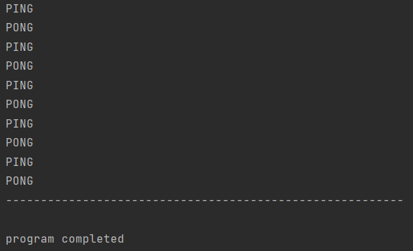

# Реализация последовательного вывода в консоль сообщений "ping" и "pong" в многопоточном режиме
 
В программе представлены:
* PingPongThread - класс, который выводит в консоль сообщения "ping" или "pong"
в зависимости от выбранного режима (устанавливается при создании объекта PingPongThread)
* Output - класс, позволяющий синхронизировать работу потоков. Содержит метод *print(OutputMode threadOutputMode)*, который
автоматически переводит поток в режим ожидания, либо возобновляет его работу в зависимости от текущего состояния (состояние определяет, какое сообщение выводится в данный момент).
* OutputMode - пеерчисление, содержащее возможные режимы работы программы: PING и PONG.

Пример работы программы приведен на скриншоте:  
